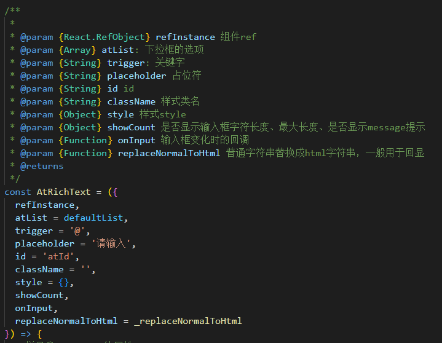
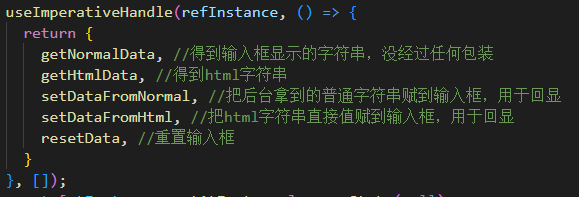

# atRichText
 
react组件，文本输入关键词弹出列表，选中变成标签，删除一块删除，例如微信输入框艾特@


GitHub地址：[https://github.com/LZF-fe/atRichText](https://github.com/LZF-fe/atRichText)

npm地址：[https://www.npmjs.com/package/atrichtext](https://www.npmjs.com/package/atrichtext)
 
## 安装和使用
 
要安装和使用这个项目，你需要按照以下步骤操作：

直接  
`npm i atrichtext`  

或者：
 
1. 克隆或下载项目代码。
2. 在终端中进入项目目录。
3. 运行 `npm install` 来安装依赖项。
4. 运行 `npm run dev` 来启动项目。
5. node示例版本18.12.0
 

 ## 效果示例

 

 ## 使用示例
 ```
 const defaultList = [{
  key: "1",
  label: "小明",
},
{
  key: "2",
  label: "小李",
}]

function App() {
  const atRef = useRef(null)

  return (
    <div>
      <AtRichText
        ref={atRef}
        id='atId'
        trigger='@'
        style={{width: '400px'}}
        atList={defaultList}
      >
      </AtRichText>
    </div>
  )
}
```
## 参数说明



## 其他说明
### forwardRef+useImperativeHandle向外抛出了这五个方法用于获取和设置输入框的值
### 父组件使用：atRef.current.getHtmlData()、atRef.current.setDataFromHtml(xxx)

